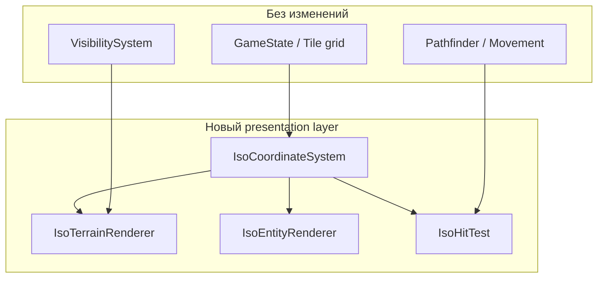
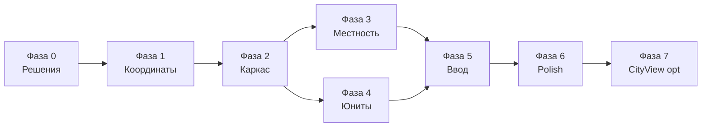

# План перехода на изометрическую карту

Цель: перевести **визуализацию** мировой карты с ортографического top-down (квадратные тайлы 48×48) на **классическую 2:1 изометрию** в духе Civilization II / Age of Empires, **не меняя** логическую сетку `(x, y)`, механику хода, pathfinding и туман войны.

> **Контекст:** CivWin Web сейчас сознательно повторяет Civ I (вид сверху). Изометрия — отдельное визуальное направление; игровые правила и `docs/ROADMAP.md` от этого не зависят.

**Ориентир по срокам:** 4–8 недель для одного разработчика (без полной перерисовки всех ассетов художником).

---

## Текущее состояние

| Компонент | Как устроено сейчас | Ключевые файлы |
|-----------|---------------------|----------------|
| Координаты | Линейное отображение: `screen = (world − viewport) × tileSize` | `src/renderer/Renderer.ts` |
| Размер тайла | 48×48 px, квадрат | `Renderer.ts`, `GameRenderer.ts` |
| Отрисовка карты | Прямой порядок `(y, x)`, offscreen terrain cache | `GameRenderer.renderMap()` |
| Спрайты местности | Квадратные PNG, автотайлинг N/S/E/W для океана и рек | `src/terrain/*` |
| Юниты / города | Центрированы в квадрате тайла | `GameRenderer`, `UnitSprites.ts` |
| Ввод | `screenToWorld` → `floor` по осям | `src/utils/InputHandler.ts` |
| Миникарта | Ортографическая проекция 1:1 | `src/renderer/Minimap.ts` |
| Городской экран | Отдельная «L»-образная сетка, top-down | `src/renderer/CityView.ts` |
| Игровая логика | Сетка 80×50, 8 соседей, A* | `Game.ts`, `Pathfinder.ts`, `VisibilitySystem.ts` |

**Что не трогаем на первом этапе:** генерация карты, бой, видимость, AI, сохранения, модалки UI, экран города (можно оставить top-down или перевести позже).

---

## Целевая архитектура

### Проекция

Стандарт **2:1 dimetric** (как Civ II):

```
screenX = (tileX − tileY) × (tileWidth / 2)
screenY = (tileX + tileY) × (tileHeight / 2)
```

Обратное преобразование — через hit-test ромба (см. фазу 1).

Рекомендуемые константы (настраиваемые):

| Параметр | Значение | Примечание |
|----------|----------|------------|
| `tileWidth` | 64 px | Ширина ромба по горизонтали |
| `tileHeight` | 32 px | Высота ромба (соотношение 2:1) |
| `tileFootprintH` | 32 px | «Глубина» клетки по Y для z-sort |
| Anchor | верхняя вершина ромба | Точка `(screenX, screenY)` — центр верхней грани |

Логические координаты `(x, y)` **остаются** прямоугольной сеткой; изометрия — только presentation layer.

### Порядок отрисовки (painter's algorithm)

```
for sortKey from min to max:
  draw terrain → improvements → fog → units → cities → overlays
```

Ключ сортировки: `sortKey = x + y` (диагонали), внутри диагонали — по `x`.

Текущий двойной цикл `for y … for x` **нельзя** оставить без изменений — нужен обход по `sortKey` или сортировка видимых тайлов.

### Слои рендера



---

## Стратегия миграции

Переход **инкрементальный**, за feature flag `renderMode: 'ortho' | 'iso'`.

1. Сначала математика координат + hit-test (можно показывать цветные ромбы).
2. Затем terrain с placeholder-спрайтами.
3. Затем юниты, города, оверлеи.
4. В конце — ассеты, миникарта, полировка.
5. Ortho остаётся fallback до стабилизации iso.

---

## Фазы

### Фаза 0 — Подготовка и решения (2–3 дня)

| # | Задача | Результат |
|---|--------|-----------|
| 0.1 | Зафиксировать проекцию 2:1 и размеры тайла | Константы в `src/renderer/iso/IsoConfig.ts` |
| 0.2 | Feature flag `renderMode` в настройках / URL `?iso=1` | Переключение без пересборки |
| 0.3 | Документировать anchor и z-order правила | Комментарии + unit-тесты координат |
| 0.4 | Оценить ассеты: конвертировать программно vs новые спрайты | Таблица «тип × подход» (см. ниже) |

**Критерий:** тесты `tileToScreen` ↔ `screenToTile` дают обратимость на сетке 80×50.

---

### Фаза 1 — Система координат (3–5 дней)

| # | Задача | Файлы |
|---|--------|-------|
| 1.1 | `IsoCoordinateSystem`: `tileToScreen`, `screenToTile`, `getTileBounds` | `src/renderer/iso/IsoCoordinateSystem.ts` |
| 1.2 | Hit-test: point-in-diamond + выбор ближайшего тайла при перекрытии | там же |
| 1.3 | Viewport: pan/zoom с учётом iso bounds (карта «ромбовидная» по экрану) | `Renderer.ts` или `IsoViewport.ts` |
| 1.4 | `getVisibleTileRange()` для iso — bounding box в tile-space, не прямоугольник viewport | `IsoCoordinateSystem.ts` |
| 1.5 | Unit-тесты: углы карты, wrap по X, клик по центру/краю ромба | `tests/iso-coordinates.test.ts` |

**Изменения в `Renderer.ts`:**

- Вынести `worldToScreen` / `screenToWorld` в стратегию (`OrthoProjection` / `IsoProjection`).
- `moveViewport`, `centerOn`, `clampViewportY` — пересчитать границы для iso bounding box.
- Horizontal wrap сохранить: искать ближайшую копию тайла по screen X (как сейчас для ortho).

**Критерий:** drag-pan и centerOn работают; клик попадает в правильный `(x, y)` на debug-ромбах.

---

### Фаза 2 — Каркас отрисовки (4–6 дней)

| # | Задача | Файлы |
|---|--------|-------|
| 2.1 | `IsoMapRenderer`: обход видимых тайлов в порядке `x+y` | `src/renderer/iso/IsoMapRenderer.ts` |
| 2.2 | Debug-режим: заливка ромба + координаты `(x,y)` | `GameRenderer` или iso renderer |
| 2.3 | Адаптировать offscreen terrain cache под iso viewport | `GameRenderer.renderMap()` |
| 2.4 | Сетка (showGrid): линии рёбер ромбов, не прямоугольная сетка | `renderGrid()` |
| 2.5 | Selection / goto hover: highlight ромба, не `fillRect` квадратом | `GameRenderer` |

**Offscreen cache (P4):** инвалидировать при смене viewport **и** renderMode. Размер offscreen canvas = полный экран; координаты тайлов внутри — iso.

**Критерий:** карта из цветных ромбов скроллится без артеfactов; fog/shroud накладывается ромбом.

---

### Фаза 3 — Местность и улучшения (1–2 недели)

| # | Задача | Детали |
|---|--------|--------|
| 3.1 | Базовые iso-спрайты местности | Ромб 64×32 + «высота» для hills/mountains (можно stacked sprites) |
| 3.2 | Океан / берег | Переработать `OceanTerrain` — 16 вариантов стыковки для рёбер ромба, не NSEW квадрата |
| 3.3 | Реки | Направления вдоль iso-осей (NE, SE, SW, NW) |
| 3.4 | Дороги / ж/д | Линии по рёбрам ромба; `analyzeRoadConnections` → iso-neighbours |
| 3.5 | Ирригация, шахты, форты | Позиционирование в центре ромба или с offset по «высоте» |
| 3.6 | Ресурсы (emoji badge) | Якорь — верхний угол ромба |
| 3.7 | Программный fallback | Если PNG нет — `TerrainBase.createIsoSprite()` рисует процедурный ромб |

**Пайплайн ассетов:**

| Подход | Плюсы | Минусы |
|--------|-------|--------|
| A. Скрипт «квадрат → ромб» (rotate + mask) | Быстрый старт | Артефакты на hills/forest |
| B. Новые iso PNG (64×48 с прозрачностью) | Качество | Объём работы (~12 типов × варианты) |
| C. Гибрид: процедурная база + декали | Мало ассетов | Среднее качество |

**Рекомендация:** фаза 3 стартует с **C**, параллельно готовятся ключевые **B** (grassland, ocean coast, forest).

**Критерий:** все типы местности узнаваемы; океан стыкуется без дыр на wrap-seam.

---

### Фаза 4 — Сущности: юниты и города (4–6 дней)

| # | Задача | Файлы |
|---|--------|-------|
| 4.1 | Якорь юнита: «ноги» в центре основания ромба, z-sort по `x+y` | `GameRenderer.renderUnit*` |
| 4.2 | Стеки юнитов: вертикальный offset вверх по экрану | `renderUnitsAtPosition` |
| 4.3 | Спрайты юнитов | `UnitSprites.ts` — iso-версии или billboard поверх ромба |
| 4.4 | Города: iso-иконка + цифра населения | `renderCity` |
| 4.5 | Анимации (death, blink active unit) | те же якоря |
| 4.6 | Movement path overlay | Линии между центрами ромбов |

**Критерий:** юнит на `(x,y)` визуально стоит на тайле, не «плавает» между клетками; активный юнит поверх соседних по z-order.

---

### Фаза 5 — Ввод и UX (3–4 дня)

| # | Задача | Файлы |
|---|--------|-------|
| 5.1 | `InputHandler`: все `screenToWorld` через iso hit-test | `InputHandler.ts` |
| 5.2 | Touch: увеличить hit-area для мобильных | `InputHandler.ts`, CSS |
| 5.3 | Edge scroll / keyboard pan — по iso viewport bounds | `InputHandler.ts` |
| 5.4 | Context menu — позиция у основания ромба | `main.ts` |
| 5.5 | Minimap: **вариант A** — оставить ortho; **вариант B** — skew-превью | `Minimap.ts` |

**Рекомендация для миникарты:** фаза 5 — **вариант A** (быстрее, привычнее для навигации); iso-превью — опционально в фазе 6.

**Критерий:** все жесты из README (click, drag, right-click move) работают в iso-режиме.

---

### Фаза 6 — Полировка и производительность (3–5 дней)

| # | Задача |
|---|--------|
| 6.1 | Профiling: сортировка тайлов — не аллоцировать массив каждый кадр (reuse buffer) |
| 6.2 | Terrain cache: пересборка только при Δviewport ≥ 1 tile в tile-space |
| 6.3 | Визуальные швы на wrap: проверка на x=0 / x=79 |
| 6.4 | Настройка «Render mode» в Settings UI |
| 6.5 | Обновить `README.md`, скриншоты |
| 6.6 | Удалить или deprecate ortho после стабилизации (опционально) |

---

### Фаза 7 (опционально) — City View и UI

Экран города (`CityView.ts`) логически независим. Варианты:

- **7a.** Оставить top-down (минимум работ).
- **7b.** Мини-iso для «рабочих клеток» вокруг города — единый визуальный язык.

Отложить до завершения фаз 0–6.

---

## Новые / изменяемые модули

```
src/renderer/
├── Renderer.ts                 # фасад, делегирует projection
├── GameRenderer.ts             # ветвление ortho | iso
├── iso/
│   ├── IsoConfig.ts            # tileWidth, tileHeight, anchors
│   ├── IsoCoordinateSystem.ts  # tile ↔ screen, bounds, visible range
│   ├── IsoProjection.ts        # implements ProjectionStrategy
│   ├── IsoMapRenderer.ts       # sorted tile pass
│   └── IsoHitTest.ts           # pointInDiamond, pickTile
├── ortho/
│   └── OrthoProjection.ts      # текущая логика (extract)
└── ProjectionStrategy.ts       # interface
```

---

## Тестирование

| Область | Тест |
|---------|------|
| Координаты | Round-trip `(x,y) → screen → (x,y)` для всех углов карты |
| Wrap | Тайл `(0,y)` и `(79,y)` — клик и отрисовка без разрыва |
| Z-order | Юнит южнее (больший `x+y`) рисуется поверх северного |
| Visibility | UNSEEN / EXPLORED / VISIBLE — overlay ромбом, не квадратом |
| Regression | Snapshot canvas (1–2 эталонных кадра) в ortho не ломаются |
| E2E | Playwright: select unit → move → end turn в `?iso=1` |

---

## Риски и митигация

| Риск | Вероятность | Митигация |
|------|-------------|-----------|
| Перерисовка всех ассетов затягивает проект | Высокая | Процедурный fallback + гибрид; ortho fallback |
| Падение FPS из-за сортировки | Средняя | Sort только visible tiles; terrain cache |
| Ошибки hit-test на гранях ромбов | Средняя | Unit-тесты + debug overlay |
| Ocean/river autotile в 2× сложнее | Высокая | Отдельный спринт 3.2–3.3; временно flat ocean |
| Расхождение с «Civ I parity» в ROADMAP | Низкая | Iso — визуальная опция, не меняет механики |

---

## Зависимости и порядок спринтов



**MVP iso (играбельно):** F0 + F1 + F2 + F4 (debug terrain) + F5 ≈ **2–3 недели**.

**Визуально завершено:** + F3 + F6 ≈ **ещё 2–4 недели**.

---

## Чеклист «готово к релизу iso»

- [ ] Feature flag и переключатель в Settings
- [ ] Координаты и hit-test покрыты тестами
- [ ] Карта, fog, юниты, города, selection в iso
- [ ] Path preview и goto hover
- [ ] Input (mouse + touch) без регрессий
- [ ] Миникарта navigates correctly (ortho или iso)
- [ ] Нет регрессий ortho-режима
- [ ] README / скриншоты обновлены

---

## Связанные документы

- `docs/ROADMAP.md` — игровые фазы (механики не блокируются iso)
- `IMPROVEMENTS.md` — P4 terrain cache (адаптировать под iso)
- `README.md` — после релиза: «Top-down (default) / Isometric (beta)»

*Создано: 2026-05-31.*
