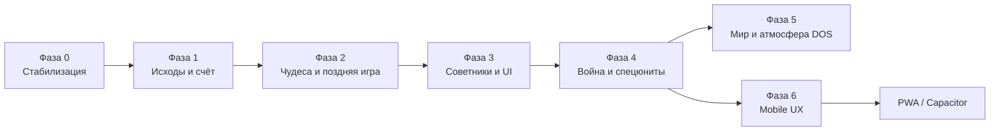
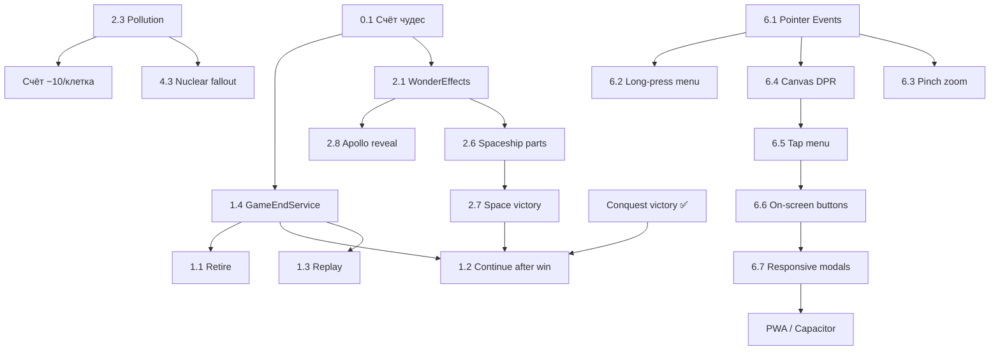

# Дорожная карта CivWin Web → Civilization I

Цель: довести веб-клон до игрового паритета с **Civilization I (1991)** по механикам, а не только по «ощущению» классической Civ.

**Уже есть (база):** карта и туман войны, города и производство, юниты и бой, исследования, правительства, налоги, дипломатия, варвары/хижины, AI, сохранения JSON, поражение, **победа завоеванием**, **Зал славы (топ‑5)**.

---

## Фазы (обзор)

| Фаза | Фокус | Ориентир |
|------|--------|----------|
| **0** | Баги и несоответствия уже сделанного | 1–2 недели ✅ (2026-05-20) |
| **1** | Исходы игры, счёт, Retire, продолжение после победы | ✅ (2026-05-20) |
| **2** | Чудеса (эффекты), загрязнение, космическая программа | ✅ |
| **3** | Советники, Demographics, меню без заглушек | ✅ |
| **4** | Море/авиация/ядерное, дипломат (подкуп), партизаны | ✅ |
| **5** | Replay, автосейв, графика океана, полировка | по мере сил |
| **6** | **Mobile UX:** touch-управление, адаптивный UI, играбельность на смартфонах | 2–4 недели ← **следующий приоритет** |

Сроки ориентировочные для одного разработчика; параллельно можно брать задачи из разных фаз, если нет жёсткой зависимости.

---

## Фаза 0 — Стабилизация (сделать первым)

Исправить то, что уже «есть», но работает неправильно или вводит в заблуждение.

| # | Задача | Зачем | Ключевые файлы |
|---|--------|--------|----------------|
| 0.1 | **Счёт чудес:** учитывать `wonder_*` в `city.buildings`, не только `city.wonders` | ✅ `countPlayerWonders`, синхронизация в `createWonder` |
| 0.2 | Убрать устаревшие строки «скоро» в локалях для **Save/Load/HoF/Attack/Fortify/View City** | ✅ |
| 0.3 | Меню **Attack / Fortify** → `handleAttackFromMenu` / `handleFortifyFromMenu` | ✅ |
| 0.4 | Меню **View City** → `openViewCityFromMenu` | ✅ |
| 0.5 | Регрессионные тесты: счёт с чудом в `buildings`, без двойного счёта | ✅ |

**Критерий готовности фазы:** победа завоеванием даёт корректный рейтинг с построенными чудесами; меню Orders/City не показывают alert «скоро» для уже реализованных действий.

---

## Фаза 1 — Исходы игры и цивилизационный счёт

Полный набор **пяти способов завершения** из мануала (quit — уже есть).

| # | Задача | Статус |
|---|--------|--------|
| 1.4 | **`GameEndService`**: conquest / retire / defeat → счёт → HoF | ✅ |
| 1.1 | **Retire** (File → Retire): счёт без бонуса завоевания | ✅ |
| 1.2 | **Продолжить игру** после победы (`scoringLocked`) | ✅ |
| 1.3 | **История мира** + модалка replay | ✅ |
| 1.5 | Поражение / победа: кнопка **History** | ✅ |

**Критерий:** можно закончить партию Retire с записью в HoF; после conquest можно остаться на карте; есть хотя бы текстовый replay.

---

## Фаза 2 — Поздняя игра: чудеса, загрязнение, космос

| # | Задача | Civ I | Зависимости |
|---|--------|-------|-------------|
| 2.1 | **`WonderEffects`**: глобальные эффекты по ID (стена, колосс, маяк, оракул, библиотека, SETI, Аполлон, ООН…) | Wonder benefits | ✅ |
| 2.2 | Чудеса в `city.wonders` + синхронизация с `buildings` (один источник правды) | — | ✅ (фаза 0) |
| 2.3 | **Загрязнение:** клетки `polluted`, рост от фабрик/населения, Recycle Center / Metro / Mass Transit | Industrial age | ✅ |
| 2.4 | **Пожар / чума** (акведук снижает риск), **срыв АЭС** при disorder + Nuclear Plant | City disasters | — |
| 2.5 | **Future Tech**: повторяемое исследование, +10 к счёту за каждое | Futuristic advances | ✅ |
| 2.6 | **Космическая программа:** юниты `ss_structure`, `ss_component`, `ss_module`; строительство в городе; запуск | Space race win | ✅ |
| 2.7 | Победа **Alpha Centauri**: остановка счёта, бонус колонистов (50 / 10k × success%), HoF | Automatic ending | ✅ |
| 2.8 | Apollo: **показать все города** на карте/миникарте | Apollo effect | ✅ |

**Критерий:** можно выиграть космосом; загрязнение влияет на счёт (−10/клетка); хотя бы 5–7 чудес дают ощутимый бонус в игре.

---

## Фаза 3 — Советники и экраны мира

| # | Задача | Civ I | Зависимости |
|---|--------|-------|-------------|
| 3.1 | **Military Advisor**: карта угроз, гарнизоны, враги у границ | Military screen | ✅ |
| 3.2 | **Trade Advisor**: торговля по городам (как в мануале) | Trade report | ✅ |
| 3.3 | **Demographics**: население, счастье, сравнение с AI | Demographics | ✅ |
| 3.4 | **Top 5 Cities** (мир): рейтинг городов всех цивилизаций | World menu | ✅ |
| 3.5 | Domestic Advisor: расширить бюджет (графики/таблица по городам), не только ползунки | Domestic | ✅ |
| 3.6 | Foreign Advisor: отделить от Intelligence или слить с понятными вкладками | Foreign | ✅ |
| 3.7 | Civilopedia: подключить пункты **Terrain, Civs, Improvements, Wonders** | Complete civopedia | ✅ |
| 3.8 | Help Index / Keyboard Commands (вместо alert) | Help | ✅ |

**Критерий:** все пять советников из меню Advisors открывают осмысленный экран; Demographics и Top Cities не заглушки.

---

## Фаза 4 — Война, юниты, дипломатия

| # | Задача | Civ I | Зависимости |
|---|--------|-------|-------------|
| 4.1 | **Транспорт / авианосец UI** для человека: погрузка/выгрузка, индикатор на борту | Sea lanes | Units.ts | ✅ |
| 4.2 | **Истребитель / бомбардировщик**: база, дальность, возврат, ограничение ходов в воздухе | Air units | — | ✅ |
| 4.3 | **Ядерная бомба**: запуск, уничтожение города, fallout/загрязнение | Nuclear | 2.3 | ✅ |
| 4.4 | **Дипломат: подкуп юнитов** (`bribe_units`) | Diplomat | DiplomacyManager | ✅ |
| 4.5 | **Партизаны** при захвате враждебного города (если нет стен / по правилам Civ I) | Partisans | CombatOrchestrator | ✅ |
| 4.6 | **Присоединение города** без полного штурма (низкая защита / дипломатия) | Join city | — | ✅ |
| 4.7 | Трирема: гибель вне прибрежья (если ещё не полностью) | Trireme | UnitMovementSystem | ✅ |
| 4.8 | **Покупка** юнита/здания за золото в City View | Buy | CityView | ✅ |

**Критерий:** типичная поздняя война (море + авиа + ядерное) проходима человеком без «только AI умеет».

---

## Фаза 5 — Полировка и паритет DOS

| # | Задача | Civ I | Зависимости |
|---|--------|-------|-------------|
| 5.1 | **Автосохранение** каждые N ходов (настройка `autoSave` → реальный вызов save) | Auto save 50 | Save API | ✅ |
| 5.2 | **Анимация океана** (palette-style или слой пены по маске берега) | Coast animation | OceanTerrain | |
| 5.3 | Доработка **проливов / автотайла океана** | Visual parity | OceanTerrain | ✅ |
| 5.4 | Баланс AI по `docs/ai.txt` / уровням сложности | Personalities | AIPlayer | ✅ |
| 5.5 | Звуки событий (чудо, космос, поражение соперника) | Audio | SoundEffects | ✅ |
| 5.6 | Undo/Redo **или** убрать пункты меню Edit | Edit menu | — | ✅ |

---

## Фаза 6 — Mobile UX (смартфоны и планшеты)

Сделать игру **играбельной на тач-экранах** без переписывания движка. Сейчас: viewport meta и адаптивные экраны до игры; in-game UI и ввод — desktop-only (мышь, hover-меню, клавиатура, модалки 760–800 px). PWA / Capacitor — **после** этой фазы.

**Уже есть (база для mobile):** viewport meta в `index.html`; pre-game экраны с `clamp()` / `vw`; production modal с `min(..., vw/vh)` и `ensureDialogInViewport()` — использовать как образец.

| # | Задача | Зачем | Ключевые файлы |
|---|--------|--------|----------------|
| 6.1 | **Pointer Events** вместо только mouse: tap = клик, drag = пан, порог ~5 px | Единый ввод для тача и десктопа | `InputHandler.ts` | ✅ |
| 6.2 | **Long-press** (~500 ms) → контекстное меню тайла | Замена ПКМ (move unit, build…) | `InputHandler.ts`, `TileContextMenu.ts` | ✅ |
| 6.3 | **Pinch-zoom** + снова включить масштаб карты | На узком экране видно мало тайлов при `tileSize=48` | `InputHandler.ts`, `Renderer.ts` | ✅ |
| 6.4 | Canvas: `width: 100%`, `touch-action: none`, **devicePixelRatio** в `resize()` | Чёткая картинка, браузер не перехватывает жесты | `index.html`, `style.css`, `Renderer.ts`, `main.ts` | ✅ |
| 6.5 | **Меню по тапу** (hamburger или bottom bar) вместо `:hover` / `mouseenter` | Выпадающие File/Orders/Advisors не открываются на таче | `main.ts`, `style.css` | ✅ |
| 6.6 | **Экранные кнопки:** End Turn, prev/next unit, Fortify, Go to (минимум) | ~30 горячих клавиш недоступны на телефоне | `main.ts`, `mobile-controls.css` | ✅ |
| 6.7 | **Адаптивные модалки:** city (760 px), tech (800 px), settings — паттерн production modal | Диалоги не влезают в ~390 px ширины | `style.css`, `styles/*.css`, `CityView.ts`, шаблоны в `public/templates/` | ✅ |
| 6.8 | **Minimap / Status:** скрыть по умолчанию на узком экране, toggle-кнопки; pointer-drag | Фиксированные 220 px окна перекрывают карту | `Minimap.ts`, `Status.ts`, `style.css` | ✅ |
| 6.9 | **Safe area** (`viewport-fit=cover`, `env(safe-area-inset-*)`), `orientationchange` / resize | Вырезы iPhone, поворот экрана | `index.html`, `style.css`, `main.ts` | ✅ |
| 6.10 | Актуализировать `@media (max-width: 768px)`: убрать мёртвые `#game-toolbar`, стили для `#menu-bar` / `#game-status-bar` | Единственный media-query сейчас устарел | `style.css` | ✅ |
| 6.11 | Help: экран **Touch controls** (или секция в Keyboard Commands) | Документация для игрока | локали, Help modal |

**Критерий готовности фазы:** на телефоне (Safari iOS / Chrome Android, portrait ~390 px) можно начать партию, перемещать юнита, открыть город, закончить ход и сохранить — без мыши и клавиатуры.

**Рекомендуемый порядок внутри фазы:** 6.1 → 6.2 → 6.4 → 6.5 → 6.6 → 6.7 → 6.3 → 6.8 → 6.9 → 6.10 → 6.11.

---

## Зависимости (что блокирует что)

---

## Рекомендуемый порядок спринтов

### Спринт A (быстрые победы)
- 0.1, 0.2, 0.3, 0.4, 0.5

### Спринт B (конец игры)
- 1.4 → 1.1 → 1.2 → 1.3 → 1.5

### Спринт C (глубина Civ I)
- 2.1 → 2.2 → 2.3 → 2.5 → 2.6 → 2.7 → 2.4 → 2.8

### Спринт D (информация для игрока)
- 3.3, 3.1, 3.2, 3.4, 3.5–3.8

### Спринт E (война XX века)
- 4.1 → 4.2 → 4.3 → 4.4 → 4.5 → 4.6 → 4.8

### Спринт F (шлифовка)
- 5.1–5.6, океан 5.2–5.3

### Спринт G (mobile UX) ✅
- 6.1 → 6.2 → 6.4 → 6.5 → 6.6 → 6.7 → 6.8 → 6.9 → 6.10 → 6.3 → 6.11

### Спринт H (приложение) ← **текущий фокус**
- ✅ PWA: `vite-plugin-pwa`, manifest, service worker, иконки
- Capacitor: обёртка `dist/`, Android / iOS

---

## Вне скоупа (пока)

- Civilization II+ механики (культура, дипломатические договоры сложнее Civ I).
- Мультиплеер, сценарный редактор уровня SMAC/Civ2.
- Полная замена графики на оригинальные DOS-ассеты (юридически и по объёму).
- PWA / Capacitor / публикация в App Store и Google Play — **PWA ✅ (2026-05-31)**; Capacitor — после деплоя на HTTPS.

---

## Метрики «мы как Civ I»

| Категория | Сейчас (~) | Цель |
|-----------|------------|------|
| Исходы игры (5 из мануала) | 2/5 (quit, defeat, conquest) | 5/5 |
| Победа (2 типа) | 1/2 | 2/2 |
| Счёт (компоненты мануала) | ~6/8 | 8/8 |
| Чудеса (эффекты) | ~1/21 | ≥15 с gameplay-эффектом |
| Советники | 2/5 полноценных | 5/5 |
| Меню без заглушек | ~95% | ~95% |
| Mobile UX (играбельность на телефоне) | 11/11 | 11/11 |

---

## Связанные документы

- `docs/manual.txt` — эталон правил (исходы, счёт, HoF).
- `docs/ai.txt` — личности лидеров для фазы 5.4.
- Анализ пробелов — чат / summary от 2026-05-20.

*Последнее обновление: 2026-05-31 (фаза 6 ✅).*
